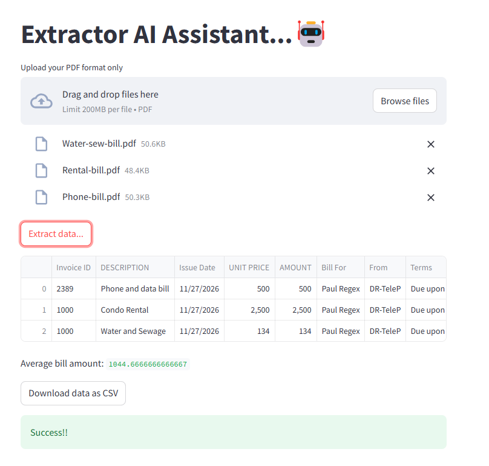

# 🧾 AI-Powered Invoice Extractor

## 📌 Overview

The **AI-Powered Invoice Extractor** is a web-based application that automates the process of extracting key invoice data from **PDF bills** using **LangChain, Streamlit, and LLaMA-3.3-70B (Groq API)**. This tool helps businesses and individuals efficiently extract, process, and analyze invoice data with minimal manual effort.

## 🚀 Features

✅ Extracts key invoice details such as:

- Invoice ID
- Description
- Issue Date
- Unit Price
- Total Amount
- Bill Recipient
- Company (From)
- Payment Terms\
  ✅ Supports batch processing of multiple **PDF invoices**.\
  ✅ Uses **LLM (LLaMA-3.3-70B)** for intelligent data extraction.\
  ✅ Cleans and normalizes extracted financial values.\
  ✅ Calculates the **average invoice amount**.\
  ✅ Allows users to **download extracted data as a CSV file**.\
  ✅ Built with **Streamlit** for an interactive web-based experience.

## 🛠️ Tech Stack

- **Python 3.9+**
- **LangChain** (for LLM-powered text extraction)
- **FAISS** (for efficient document retrieval)
- **LLaMA-3.3-70B** (LLM via Groq API)
- **OpenAI Embeddings** (for text vectorization)
- **PyPDF** (for reading PDF files)
- **Pandas** (for data processing and storage)
- **Streamlit** (for the web-based interface)

## 📂 Project Structure

```
📁 AI-Invoice-Extractor
│── 📁 images             # Folder to store images (if needed)
│── 📁 data                 # Folder to store processed invoices (if needed)
│── 📝 README.md            # Documentation
│── 📄 app.py               # Streamlit application
│── 📄 helpers.py           # Helper functions for text extraction, processing, and LLM interaction
│── 📄 requirements.txt     # Dependencies
│── 📄 .env                 # API keys (add Groq API key here)
```

## 📦 Installation & Setup

### 1️⃣ Clone the repository

```bash
git clone https://github.com/IbrahimAlobid2/AI-Invoice-Extracto.git
cd AI-Invoice-Extractor
```

### 2️⃣ Create a virtual environment

```bash
python -m venv venv
source venv/bin/activate  # macOS/Linux
venv\Scripts\activate     # Windows
```

### 3️⃣ Install dependencies

```bash
pip install -r requirements.txt
```

### 4️⃣ Set up API Keys

Create a `.env` file in the root directory and add your **Groq API key**:

```
GROQ_API_KEY=your_groq_api_key_here
```

### 5️⃣ Run the application

```bash
streamlit run app.py
```

## 🎯 Usage Instructions

1️⃣ Open the **web interface** in your browser (Streamlit will provide the link).\
2️⃣ **Upload one or more PDF invoices**.\
3️⃣ Click **"Extract bill data"**.\
4️⃣ View extracted invoice details and **download the data as CSV**.

## 🖼️ Screenshots

  

## 🛠️ Troubleshooting


### If PDF extraction returns empty text:

- Ensure your PDFs contain **selectable text** (not just images). If the text is **scanned**, consider using an **OCR tool like Tesseract**.

## 🤝 Contribution

We welcome contributions! Feel free to:

- Open an issue
- Submit a pull request
- Suggest improvements

#

